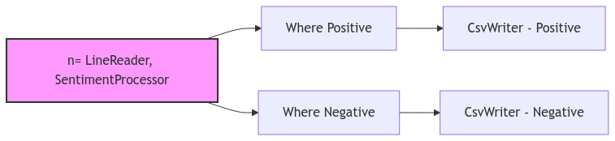
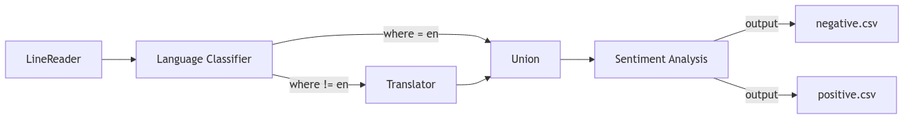
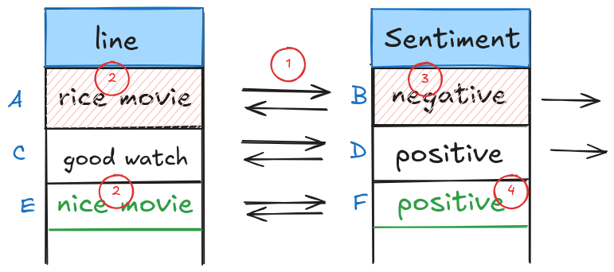
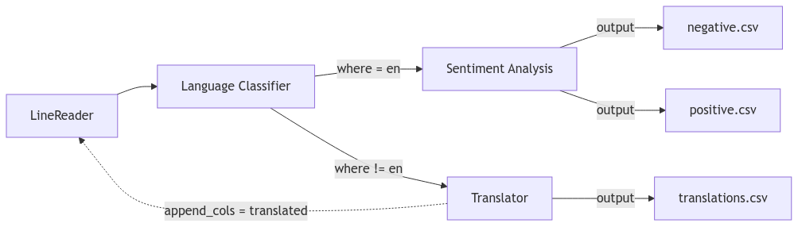

# Popper

## Introduction
In this lab we will look at a dataflow system called Popper for building ML
workflows.  One of the many interesting features of Popper that you will learn
about is its built-in support for in-flight error handling. Popper implements a 
python based dataflow language called PYSCOPE for specifying dataflow programs. 
Users can use traditional data processing operators such as map, filter, join, 
etc. in addition to Popper's in-flight error handling operators ([discussed
later](#part-1-understanding-pyscope)).

## Part 0: Getting Started
### Prerequisites
- Install Docker Desktop for your operating system:
  - [Docker Desktop for Windows](https://docs.docker.com/desktop/install/windows-install/)
    - Note: Windows Subsystem for Linux (WSL2) required
  - [Docker Desktop for macOS](https://docs.docker.com/desktop/install/mac-install/)
  - [Docker Desktop for Linux](https://docs.docker.com/desktop/install/linux-install/)
    
- Verify Docker Engine is running by checking the Docker Desktop application status

### Installing Popper

Pull the Popper Docker image:
```
$ docker pull datasystems/popperlite:latest
```

Launch Popper in Docker:
   
<details>
<summary><strong>Note for macOS Users</strong></summary>

Port 5000 is reserved on macOS. Use this command to map to port 6000 instead:
<br>
docker run -it --name popper -p 5173:5173 -p 6000:5000 datasystems/popperlite:latest /bin/bash

</details>
<br>

```
docker run -it --name popper -p 5173:5173 -p 5000:5000 datasystems/popperlite:latest /bin/bash
```

**Using VS Code Dev Containers Extension (Recommended)**

For a better development experience, we recommend using VS Code with the Dev Containers extension:

- Install the [Dev Containers extension](https://marketplace.visualstudio.com/items?itemName=ms-vscode-remote.remote-containers) in VS Code

- After starting the container as shown above, click the blue button in the bottom-left corner of VS Code (or press Ctrl/Cmd + Shift + P and search for "Dev Containers: Attach to Running Container")

- Select the running `popper` container

- VS Code will reopen connected to the container, giving you better experience :)

You should now see a terminal in VS Code that looks like:

```
root@75a91d135cdf:/popper#
```

Start Redis:
```
root@75a91d135cdf:/popper# make redis
```

Start the Object Store:
```
root@75a91d135cdf:/popper# make objstore
```

Test if the installation was successful, try running some tests in a new terminal:

<details>
<summary>If you are not using VS Code Dev Containers</summary>

```
# Connect to container

$ docker exec -it popper /bin/bash
```
</details>
<br>


```
root@75a91d135cdf:/popper# pytest -s scope/integration_tests/append_test.py
```

Upon successful test completion, navigate to the ws24_demo directory:
```
cd ws24_demo
```

Initialize the required models by executing the `test_light_models.py` script:
```
root@75a91d135cdf:/popper/ws24_demo# python3 test_light_models.py
```


Our docker image comes with pre-installed Python dependencies required for
Popper.

## Part 1: Understanding PYSCOPE

Before we start writing workflows, let's have a look at PYSCOPE, the dataflow
language POPPER uses to write workflows. PYSCOPE extends the SCOPE language from
Microsoft [VLDB 2008] with inflight error-handling.

* `Extractor`: Constructs rows from unstructured sources like files.
* `Processor`: Processes each row individually.
* `Reducer`: Processes groups of rows.
* `Combiner`: Combines multiple rows (like a traditional join).
* `Outputter`: Writes rows to a data sink.


These are base operators provided by PYSCOPE; you can extend these operators to
build you own custom operators. for e.g. `LineReader` can be an `Extractor` that
reads lines from a file.

Now, since we are equipped with the necessary knowledge, let's write our first
workflow!


## Part 2: Writing your first ML workflow

We will walkthrough a simple workflow to get a flavor of how they are written in
Popper. The point of this workflow is to create a simple sentiment analysis
pipeline.

We write 3 main custom operators for this job:
1. `LineReader`: This extends the `Extractor` class and reads lines from a file.
(you can find this operator implemented in `scope/builtins/extractors.py`)
2. `SentimentProcessor`: This extends the `Processor` class and performs
sentiment analysis on the input text. (we will implement this operator in the
next few steps)
3. `CsvWriter`: This extends the `Outputter` class and writes the output to a
CSV file. (you can find this operator implemented in
`scope/builtins/outputters.py`)

In our working directory "ws24_demo", let's create a new file called `ml_test.py` and start writing our code.


First let's get all our necessary imports out of the way:

```python
import os
from typing import Any, Generator

import config
from scope.builtins.outputters import CsvWriter
from scope.core.job import Job
from scope.core.jobbuilder import JobBuilder
from scope.core.nodes import OutputterNode
from scope.core.utils import topologicalSort
from scope.builtins.extractors import LineReader
from scope.model.row import Row
from scope.model.rows import Rows
from scope.operators.outputter import Outputter
from scope.operators.processor import Processor
from transformers import pipeline
```

In order to write the workflow, we will use the `JobBuilder` class from
`jobbuilder.py`. This will be our entry point to writing a workflow. The
`JobBuilder` provides a set of methods to add operators to the workflow like
`extract()`, `process()`, `output()`, etc. These operators are then chained
together to form a workflow.

Let's first create a `prepareJob()` function that will return a `Job` object.
Here we will give it the input and output paths and then chain the operators
together to form the workflow.

```python
def prepareJob() -> Job:
    # define input/output paths
    abs_out_path = os.path.join(config.popper.WORKSPACE, "sentiment/ml_out.txt")
    abs_in_path = os.path.join(config.popper.WORKSPACE, "sentiment/ml_in.txt")
```

Within the `prepareJob()` function, we will create a `JobBuilder` object and
then chain the operators together to form the workflow.

```python
    jobc = JobBuilder()
    return jobc.extract(using=LineReader(frm=abs_in_path, out_col=b"line")) \
            .process(using=SentimentProcessor(in_col=b"line", sentiment_col=b"sentiment")) \
            .output(using=CsvWriter(to=abs_out_path, order=[b"line", b"sentiment"])) \
            .job.pre_build()
```

<details>
<summary>Optional: read more about JobBuilder</summary>

JobBuilder also has these (constructor) parameters:
- `disable_opts`: This is an optional parameter that allows you to selectivley disable the optimizations for the job.
- `dag_opt`: This is a boolean parameter that enables **all DAG optimizations** for the job.
- `enable_gc`: This is a boolean parameter that enables **garbage collection** for the job.
- `hint`: This is an optional parameter that allows you to specify a hint for the job.
- `template`: This is an optional parameter that allows you to specify a name for the job.

Once the job is created, we can call `pre_build()` which will add the necessary
edges to the workflow and saves the initial job state to Redis.
</details>
<br>

Now, let's create our test function `test_run_ml()` to see if our workflow is
working as expected, In this test we will first call `prepareJob()` and then
call `build()` which will type check the entire workflow, optimize the workflow,
and prepare the job for execution.

Finally, we can call `run()` which will execute the workflow, wait for all
stages to complete and return our desired output.

```python
def test_run_ml() -> None:
    job = prepareJob()
    job.build().run()

```

We have not implemented the `SentimentProcessor` operator yet, lets do that now.

Some necessary methods to implement for your custom operator:

You will need to inherit from the `Processor` class and implement the
`__call__()` method.

- The `Processor` base class provides two methods `pre_call()` and `post_call()`
which can be used to perform any setup/cleanup operations.
- The `pre_call()` method is called before the `__call__()` method is called.
You can use this method to load any models you might need.
- The `post_call()` method is called after the `__call__()` method is called.
You can use this method to clean up any resources you might have initialized in
the `pre_call()` method.
- The `__call__()` method is where the main logic of your custom operator goes.

Let's implement `SentimentProcessor` to get a better understanding of how this
works.

```python
class SentimentProcessor(Processor):
    # Initialize the operator with the input and output column names
  def __init__(self, in_col: bytes, sentiment_col: bytes):
    # the `Processor` class takes in two arguments: `in_col_types` and
    # `out_col_types`. These are dictionaries that map the input and output
    # column names to their respective types.
    super().__init__(
        out_col_types={b"model": b"str", sentiment_col: b"str", b"confidence": b"float"},
        in_col_types={in_col: b"str"}
    )

    # Remember the input and output column names
    self.in_col = in_col
    self.sentiment_col = sentiment_col

    # set the sentiment pipeline to None initially
    self.SENTIMENT_PIPELINE = None

  def pre_call(self):
    # Initialize the sentiment analysis pipeline, this is done here, so that
    # we don't have to load the model again and again for each row in the __call__() method
    self.SENTIMENT_PIPELINE = pipeline(
        "sentiment-analysis",
        model="distilbert-base-uncased-finetuned-sst-2-english",
        device=-1
    )

  def post_call(self, **kwargs: Any) -> list[Row]:
    # Clean up the sentiment pipeline
    self.SENTIMENT_PIPELINE = None

  def __call__(self, input_row: Row, *args: Any, **kwargs: Any) -> Generator[Row, None, None]:
    # The __call__() method is where the main logic of your custom operator goes.
    # It takes in an input row and yields an output row.

    # Get the input text
    line = input_row.get_value(self.in_col)
    
    # Perform sentiment analysis
    result = self.SENTIMENT_PIPELINE(line)[0]
    sentiment_label = result['label']
    confidence = result['score']

    # Create output row
    out_row = Row(Rows(**kwargs), from_rows=[input_row], data_dict = {
        self.sentiment_col: sentiment_label,
    })

    # Instead of using data_dict, we can also use the `set()` method to set the
    # value of a column in the output row.
    out_row.set(b"confidence", confidence)
    
    yield out_row
```

Now, we can run our test to see if the workflow is working as expected:

```
# Run test
root@75a91d135cdf:/popper# pytest -s ws_24/ml_test.py
```

Once the job is completed, the output will be saved at `data/sentiment/ml_out.txt`.
We observe that all the positive and negative sentiments are correctly
classified and written to the output file.

### Visualizing the workflow

Popper also provides a dashboard to visualize the workflow.  To start the
visualization backend, run the following command:
```
root@75a91d135cdf:/popper# make server
```

To spin up the UI run the following command:
```
root@75a91d135cdf:/popper# make demo
```
You should now be able to see the dashboard by navigating to [localhost:5173](http://localhost:5173) in your web browser.

<!-- Popper also supports performance tracing. To trace jobs, start Jaeger by running:

```
root@75a91d135cdf:/popper# make jaeger
```

Then rerun the job using the `pytest` command above. Once the job finishes, you
should be able to see the trace by navigating to
[localhost:16686](http://localhost:16686). -->

This hopefully gave you a good idea on how to write workflows in Popper, 

---
## Exercise 1
> Task: Modify the sentiment analysis job to separate the positive and negative sentiments into different files.

Starting with the existing sentiment analysis job, implement the following
requirements:

<input type="checkbox" disabled> Try using the `where()` operator in `JobBuilder` to separate the positive and negative sentiments

<input type="checkbox" disabled> The output should show now only show the `line` column

<details>
<summary>Need help getting started?</summary>

- Learn how to write `where()` operators from `scope/integration_tests/where_as_group_test.py`.


- You will need two separate outputters to write to two different files for the positive and negative sentiments.


- Try using the `get_node()` method to break the chain and give access to the last node in the workflow (see next section for more details).
</details>
<br>

---
Popper provides you with a `get_node()` accessor method in `JobBuilder` which
returns the last node in the workflow. If you observe, each node in our previous
workflow was connected in a chain like this:

```python
jobc.extract(using=LineReader(frm=abs_in_path, out_col=b"line")) \
    .process(using=SentimentProcessor(in_col=b"line", sentiment_col=b"sentiment")) \
    .output(using=CsvWriter(to=abs_out_path, order=[b"line", b"sentiment"]))
```
using the `get_node()` method, we can **break** the chain and get access to the
last node in the workflow. for eg. we want to break the chain after the
`process()` method and give access of this set of nodes to some other operator.
We can do this as follows:

```python
n = jobc.extract(using=LineReader(frm=abs_in_path, out_col=b"line")) \
        .process(using=SentimentProcessor(in_col=b"line", sentiment_col=b"sentiment")) \
        .get_node()
```
we can now give this node `n` to some other operator using the `inp=` parameter
provided by the node creation methods like `where()`, `output()`, etc.

```python
jobc.where(inp=n, predicate=is_positive, in_col_types={b"sentiment": b"str"}) \
    .output(using=CsvWriter(to=abs_out_path, order=[b"line"], gt=(gt_pos_path, csv_parse)))

jobc.where(inp=n, predicate=is_negative, in_col_types={b"sentiment": b"str"}) \
    .output(using=CsvWriter(to=abs_out_path, order=[b"line"], gt=(gt_neg_path, csv_parse)))
```



## Part 3: Multi-lingual sentiment analysis 

## Exercise 2
> Task: Create a multi-lingual sentiment analysis workflow that can handle both English and non-English text.

Starting with the sentiment analysis job from Exercise 1, implement a workflow that:

Use the following ML models:
  * Language classifier: `papluca/xlm-roberta-base-language-detection`
  * Translator: `facebook/nllb-200-distilled-600M`
  * Sentiment analyzer: `cardiffnlp/twitter-roberta-base-sentiment`

Your workflow should:

<input type="checkbox" disabled> Uses a language classifier ML model to detect if input text is in English

<input type="checkbox" disabled> Use an ML model that Translates non-English text to English

<input type="checkbox" disabled> Performs sentiment analysis on all texts (both original English and translated)

<input type="checkbox" disabled> Outputs results to separate files for positive and negative sentiments

The workflow should follow this structure:




<details>
<summary>Need help getting started?</summary>

1. You'll need to create these new operators:
   - `LanguageClassifier`: Extends `Processor` to detect the text language
   - `Translator`: Extends `Processor` to translate non-English text to English


2. Use the `where()` operator twice after the classifier:
   - One branch for English text (where language == "en")
   - One branch for non-English text (where language != "en")


3. Use the `union()` operator provided in the `Jobbuilder` to combine the English and translated texts before sentiment analysis

</details>

---


## Part 4: Error handling

We refer to Popper workflow with error handlers as *Reactive Dataflows*. These
are modeled as directed cyclic graphs which allow downstream operators to fix
errors that may have occured in upstream operators. This is crucial for
in-flight error handling.

Popper provides various APIs for applying upstream modifications:
* `row.edit()`: allows you to edit a row in the output of an upstream operator.
For example, let us say we got a row with a spelling mistake `{b"line": "rice movie!"}`
which then gets `{b"sentiment": "negative"}`. A later operator can fix the
spelling error by calling `row.edit({b'line': "nice movie"})` to fix the
upstream row containing the line output. 

It will do *backward tracing* to first identify the upstream output row
containing the column *line*; it will delete this upstream output row and append
the editted row. Popper will automatically incrementally propagate these deletes
and appends downwards.

<p align="center">
  
</p>


* Similarly, `row.append()` takes a dictionary of column names to column values. 
For example, let us say we got a `input_row` with `{b"line": "my wife and I liked the food!"}`. 
We can call `row.append({b"line": "my husband and I liked the food!"})`. Append
works in a manner similar to `edit` with the only difference that it does not 
delete the original upstream row.

* `row.delete()`: allows you to delete upstream rows. It needs a column to
perform backward tracing. In the example above, row.delete([b'line']) deletes
both the line and the sentiment row, where row.delete([b'sentiment']) only
deletes the sentiment row.

Similar to `in_col_types` and `out_col_types`, the base Operator class has the
`edit_cols`, `append_cols` and `delete_cols` parameters that are needed if the Operator 
is using the above APIs.  These parameters help JobBuilder realize the back
edges which are further used to build the auxiliary graph and plan stages.

---
## Exercise 3
> Task: Use Popper's error handling APIs to catch and fix ML errors.
 
In this exercise, we introduce synthentic errors into the translation model.
Change your translation to 

```
  translated_text = random.choices([text, translated_text], weights=[0.1, 0.9])[0]
```

Now because the translations can be incorrect, we want to send them back to 
the classifier. If the classifier again classifies it as non-english, we would
like to drop the row.

Additionally, try outputting the translated along with the original line
to a separate file.

Starting with the multi-lingual sentiment analysis job from Exercise 2, implement error handling that:

<input type="checkbox" disabled> Synthetically make translations erroneous

<input type="checkbox" disabled> Send translated texts back to the classifier to double check that they are now in English

<input type="checkbox" disabled> Prevents infinite loops by tracking which rows have already been translated

<input type="checkbox" disabled> Drops rows that fail to identify as English even after translation

<input type="checkbox" disabled> Outputs the translated and original lines to a separate file (translations.csv)

The workflow should follow this structure:




<details>
<summary>Need help getting started?</summary>

1. Try using the `row.append()` method to add another row with translated line
back to the output of the `LineReader` operator. Make sure, you specify
`b"line"` in `append_cols` parameter.

2. Test by forcefully adding a random choice to simulate translation errors to
see if you can successsfully drop the translated rows trying to get translated
again.

3. You can `yield row.append(...)` and `yield Row(...)` from translator. The
second yield (output row) is the one that can be written in `translations.csv`.

</details>
<br >
